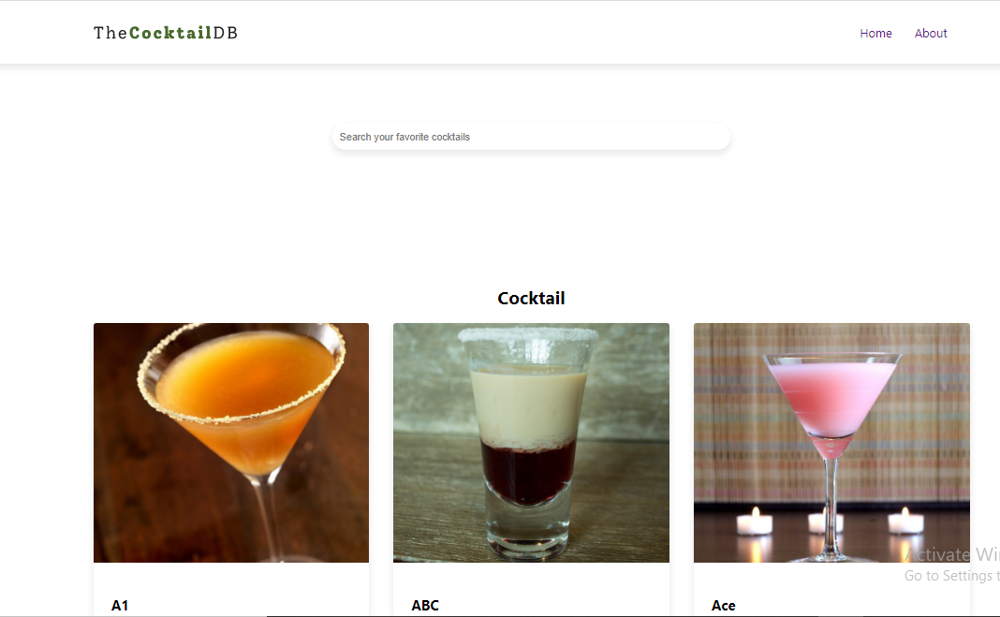
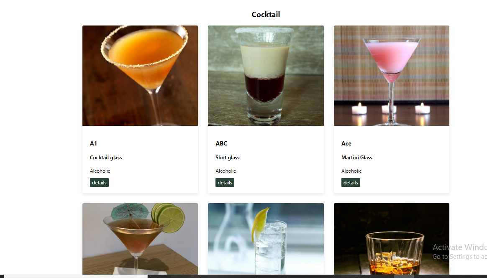
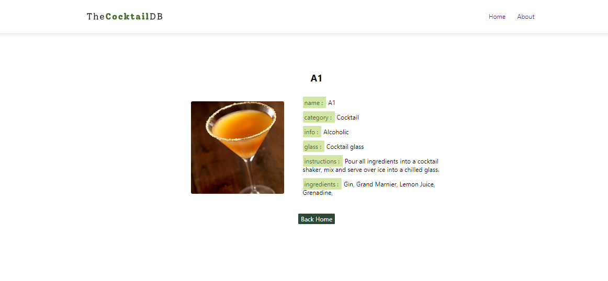
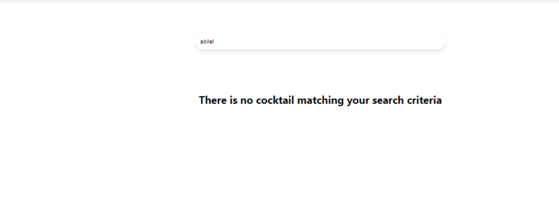
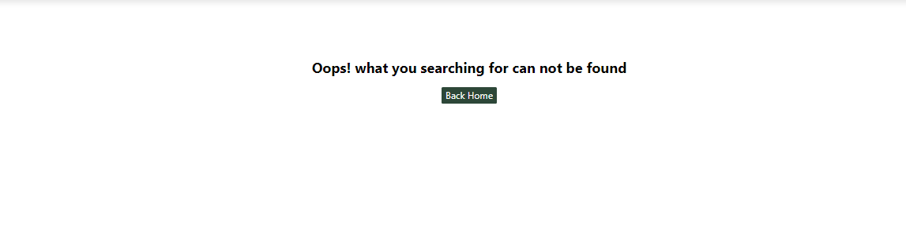
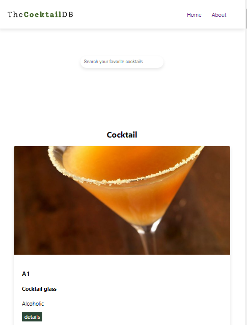

# Cocktail
Completed Another React project

 Completed another minor project towards the cause of learnng the react 
 Library. The Cocktail web app makes use of react router package to navigate
 between pages. also one can make use of search form to search for cocktails, 
 data is obtain from the https://www.thecocktaildb.com/api/json/v1/1/search.php?s=
 API.
 Below is the Desktop and mobile View of the Complete Cocktail web app

# Desktop View
 

 

 

 

 

 # Mobile View

 
